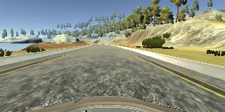
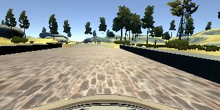

**Behavioral Cloning Project** 


The goals / steps of this project are the following:
* Use the simulator to collect data of good driving behavior
* Build, a convolution neural network in Keras that predicts steering angles from images
* Train and validate the model with a training and validation set
* Test that the model successfully drives around track one without leaving the road
* Summarize the results with a written report


[//]: # (Image References)

[image1]: ./examples/center.jpg "Model Visualization"
[image2]: ./examples/resized.jpg "resizing to 32x96x3"
[image3]: ./examples/cropped.jpg "cropped"
[image4]: ./examples/recovery1.jpg "Recovery Image"
[image5]: ./examples/recovery2.jpg "Recovery Image"
[image6]: ./examples/normal.jpg "Normal Image"
[image7]: ./examples/flipped.jpg "Flipped Image"
[image8]: ./examples/bridge.jpg "Bridge Recovery"

# Data Record

The coding was done via Python 3.5.2 IDLE.

## Normal Driving

A great simulator was provided by UDACITY in order to record good driving data just by driving a car in the simulator. A normal or a good drive is assumed to be a car that drives in the center of the road whether the road is straight, has turns or the path is on a bridge. A good driving car never gets to the sides or shoulder of the road and never has any of its wheels running over the road side lines.

The very first step is to drive the car on the road while keeping it in the center and also once in a while try to get the car back to the center of the road when it is getting close to the sides. Also as suggested in the forum, it is beneficial to record data both in clockwise and counter-clockwise directions in order to have more general data. Hence, two lapses of drive in opposite directions were recorded. The speed of the car was kept around 9 mph. Steering angle control was done with the computer mouse which is much more effective than the keyboard. A joystick could be a help in recording a better data set. During the record of the first two lapses, it was tried to change the streering angle as smooth as possible and also to guide the car back to the center of the road whenever it was drifting toward the sides. 



## Recovering

As car might be drifted toward the edges of the road, it has to be able to adjust the steering angle to get back to the center of the road. Also for situations where one tire runs over the side lines, the car has to adjust the steering angle to quickly get away from the edge toward the center. These characteristics must be recorded and fed to the CNN to be used later on in the Autonomous driving mode.

The described situations were recorded and stored in the data set in both clockwise and counter-clockwise directions.


## Bridge Recovering

After running a few cases of autonomous drive, it was noted that the car tends to drive straight on the bridge whether it is in the center of the road or closer to one side. Driving straight when the car is close to the sides will result in running over the side lines once the car exits the bridge. Hence, the solution for the car is to learn to get back to the center and continue to drive straight afterward.

A set of data was recorded for cases in which the car is close to one edge on the bridge and then drives toward the center and continues on driving straight.



## Summary of Data

|Recorded Data 		|Center Camera      	|Left Camera    	|Right Camera   	| 
|:-----------------:|:---------------------:|:-----------------:|------------------:| 
|Normal driving		|3,447          		|3,447       		|3,447   			|
|Recovering 		|1,341          		|1,341       		|1,341   			|
|Bridge Recovering	|433            		|433        		|433    			|


# Pre-processing

## Training and Validation Data Set

The entire recorded image data set has been split into 80% Training and 20% Validation data set to evaluate loss without being worried about overfitting.

## Batch Generator

Pre-processing of the images are performed within the batch generator except the normalization and cropping of the image.

## Mirrored images

All images from left, center and right cameras were flipped and their corresponding steering angles were multiplied by -1. A bias of 0.3 was added to the right camera images and subtracted from the left camera ones to prepar them to be represented as a center camera image.

       

## Rescaling

All images were rescaled/resized to 32x96x3 to be easier to process. This required a change in the drive.py file to be able to match the model.h5 image file shapes.


## Cropping

Top and bottom of each image were cropped in order to only feed the road part of image to avoid confusion.

    model.add(Cropping2D(cropping=((12,5), (0,0)), input_shape=(32,96,3)))
    


## Normalization

Normalization of pixel values was done by using Batchnormalization method as a Keras layer.

    model.add(BatchNormalization(input_shape=(15,96,3), axis=1))
    
    
# Model Architecture

Nvidia model has been used as a starting point. Modifications such as droput and non-linearization are used to optimize the model for working data set.

Below is a summary of the model architecture.

```
_________________________________________________________________
Layer (type)                 Output Shape              Param #   
=================================================================
cropping2d_1 (Cropping2D)    (None, 15, 96, 3)         0         
_________________________________________________________________
batch_normalization_1 (Batch (None, 15, 96, 3)         60        
_________________________________________________________________
conv2d_1 (Conv2D)            (None, 7, 47, 3)          84        
_________________________________________________________________
dropout_1 (Dropout)          (None, 7, 47, 3)          0         
_________________________________________________________________
activation_1 (Activation)    (None, 7, 47, 3)          0         
_________________________________________________________________
conv2d_2 (Conv2D)            (None, 5, 23, 24)         672       
_________________________________________________________________
dropout_2 (Dropout)          (None, 5, 23, 24)         0         
_________________________________________________________________
activation_2 (Activation)    (None, 5, 23, 24)         0         
_________________________________________________________________
conv2d_3 (Conv2D)            (None, 3, 21, 36)         7812      
_________________________________________________________________
dropout_3 (Dropout)          (None, 3, 21, 36)         0         
_________________________________________________________________
activation_3 (Activation)    (None, 3, 21, 36)         0         
_________________________________________________________________
conv2d_4 (Conv2D)            (None, 2, 20, 48)         6960      
_________________________________________________________________
activation_4 (Activation)    (None, 2, 20, 48)         0         
_________________________________________________________________
conv2d_5 (Conv2D)            (None, 1, 19, 64)         12352     
_________________________________________________________________
flatten_1 (Flatten)          (None, 1216)              0         
_________________________________________________________________
dense_1 (Dense)              (None, 1164)              1416588   
_________________________________________________________________
dropout_4 (Dropout)          (None, 1164)              0         
_________________________________________________________________
activation_5 (Activation)    (None, 1164)              0         
_________________________________________________________________
dense_2 (Dense)              (None, 100)               116500    
_________________________________________________________________
dropout_5 (Dropout)          (None, 100)               0         
_________________________________________________________________
activation_6 (Activation)    (None, 100)               0         
_________________________________________________________________
dense_3 (Dense)              (None, 50)                5050      
_________________________________________________________________
dropout_6 (Dropout)          (None, 50)                0         
_________________________________________________________________
activation_7 (Activation)    (None, 50)                0         
_________________________________________________________________
dense_4 (Dense)              (None, 10)                510       
_________________________________________________________________
activation_8 (Activation)    (None, 10)                0         
_________________________________________________________________
dense_5 (Dense)              (None, 1)                 11        
=================================================================
Total params: 1,566,599
Trainable params: 1,566,569
Non-trainable params: 30
_________________________________________________________________
```


# Training Data

A generator was used to generate batch of images for training and validation data sets to be fed in during training. Batch size of 64 has been defined to be generated.
Adam optimizer with manual learning rate of 10^-4 was used. Also, a total of 45 epochs was done in the training process. It is worth to mention that the validation set loss reduced in the first 3 to 5 epochs then increased to its maximum around 8th epoch. From epoch 11 to 45, the loss almost steadily reduced and then flattened afterward.

```
Epoch 1/45
17s - loss: 0.0850 - val_loss: 0.6666
Epoch 2/45
11s - loss: 0.0914 - val_loss: 0.0607
Epoch 3/45
12s - loss: 0.0649 - val_loss: 0.0739
Epoch 4/45
10s - loss: 0.0648 - val_loss: 0.1332
.
.
.

Epoch 42/45
1s - loss: 0.0426 - val_loss: 0.0589
Epoch 43/45
2s - loss: 0.0373 - val_loss: 0.0561
Epoch 44/45
1s - loss: 0.0463 - val_loss: 0.0574
Epoch 45/45
1s - loss: 0.0381 - val_loss: 0.0521
```


# Submission

## Drive.py

A modified version of drive.py provided by UDACITY to run the simulation. A change was done for the code to be able to read image size of 32X96X3 instead 160x320x3.

## Model.py

Contains all the steps mentioned above. This file will also save model.h5 which is necessary to run the simulation in autonomous mode.

## Video.mp4

This is a video of the self-driving simulation based on the trained model.h5 which is produced by model.py.

## Running the simulation

In order to run the simulation in autonomous mode, the following command needs to run and then simulation file to be opened to start the autonomous mode.

```
python drive.py model.h5
```

# Conclusion

This was a great opportunity to understand the self driving car concept based on image processing. There are many potentials in improving the code to find the most optimized point. Pre-processing of the data has a major impact on the results. Grayscaling, image rescale, contrast change, and many other pre-process methods could be used to improve the results. Also, size of the recorded data contributes to the training. A good set of recorded data, whether large or small, can significantly improve the autonomous car performance. Other areas of improvement includes the layer configuration, activation function, dropout rates, and more data augmentation in this project. 

